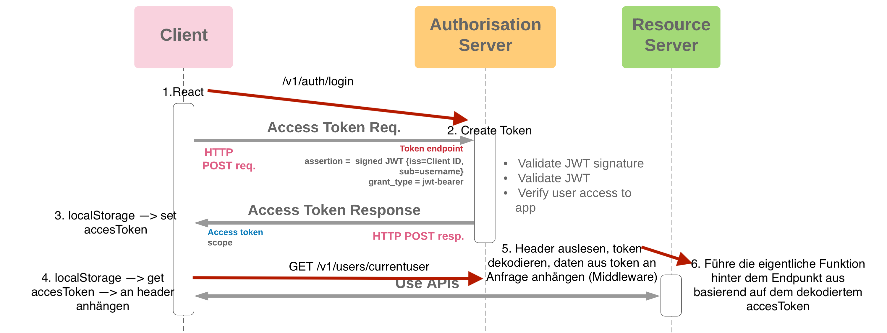

# Einfache Auth Express App



Aufgabe 1 ist die Mindestabgabe. Aufgabe 2 + 3 sind die Zusatzaufgaben

Erstellt bitte eure eigenen Repos aus meinem

## Aufgabe 1

Abgabe: Link zu eurem Repo, Kommentiere deinen Code ausführlich

[Link zu dem Commit aus der Vorlesung](https://github.com/tomtechstarter/express-template/commit/e40282c879e483ce08ec6c71bd3e86615470bc3c)

1.0 erstelle eine .env mit folgenden Werten und ersetze diese durch passende

1.1 Starte die App zunächst un lege in Postman die 3 Anfragen (POST /v1/auth/login, POST /v1/auth/signup, GET /v1/users/currentuser ) an. Nutze diese um die folgenden Umsetzungen zu überprüfen

```javascript
PORT = 5050;
DB_USERNAME = root;
DB_PASSWORD = root1234;
DB_NAME = testing;
NODE_ENV = dev;
JWT_SECRET = mysecret;
```

1.1 Erstelle die Funktionen zum erstellen und dekodieren eines JWT Tokens /src/services/auth

1.2 Fülle die EndPunkte des UserRouters und des AuthRoters mit den jeweiligen Funktionen

--> Auth: Login, Signup

--> User: GET currentuser

1.3 Binde die auth middleware in der /user Route ein
1.4 Fülle die auth Middleware mit der richtigen Funktion

## Zusatzaufgabe 2:

Verschlüssele dein Passwort in der Datenbank mit bcrypt

## Zusatzaufgabe 3

In der React App ist die Signup Funktion noch nicht gegeben. Setze diese um
[Link zur React App](https://github.com/tomtechstarter/auth-react)
